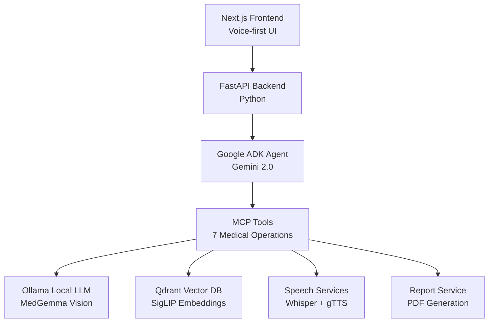

# Rural Medical AI Kiosk Documentation

Welcome to the documentation for the Rural Medical AI Kiosk - an intuitive, voice-first AI system designed to provide dermatological guidance in rural and underserved areas.

!!! warning "Medical Disclaimer"
    This system is **NOT a diagnostic tool** and **NOT a replacement for professional medical care**. It provides guidance and case history preparation only. All findings require professional medical verification.

## Overview

The Rural Medical AI Kiosk is a comprehensive telemedicine solution that combines:

- **Voice-first Interface**: Designed for users with low tech literacy
- **AI-Powered Consultations**: Google ADK SOAP Agent with Gemini 2.0
- **Medical Image Analysis**: MedGemma for dermatological image analysis
- **RAG Similarity Search**: 6,500+ similar case findings using SigLIP embeddings
- **Multi-language Support**: English, Hindi, Tamil, Telugu, and Bengali
- **Professional Reports**: Patient summaries and physician SOAP reports with PDF export

## Key Features

### 🎯 SOAP Framework
Structured medical consultation following the industry-standard SOAP methodology:

- **S**ubjective: Patient's narrative and symptoms
- **O**bjective: Observable findings and images
- **A**ssessment: Possible conditions with ICD-10 codes
- **P**lan: Guidance and next steps

### 🎤 Voice-First Design
- Large touch targets (min 48px)
- High contrast UI (teal/cream/amber)
- Minimum 20-24px font sizes
- Microphone-primary interaction
- Multi-language voice support

### 🤖 Intelligent Agent System
- **Google ADK**: Agent Development Kit with Gemini 2.0
- **MCP Tools**: 7 medical operation tools
- **Automatic Function Calling**: Context-aware tool execution
- **Multi-turn Conversations**: Maintains full consultation context

### 📊 Report Generation
- **Patient Summaries**: Simple, plain-language reports
- **Physician Reports**: Formal SOAP documentation with ICD-10 codes
- **PDF Export**: Professional PDF generation with ReportLab
- **Multi-language**: Reports in 5+ languages

## Architecture

## Quick Links

-   :material-clock-fast:{ .lg .middle } __Quick Start__

    ---

    Get up and running in 5 minutes

    [:octicons-arrow-right-24: Getting Started](getting-started/quick-start.md)

-   :material-cog:{ .lg .middle } __Installation__

    ---

    Step-by-step installation guide

    [:octicons-arrow-right-24: Install](getting-started/installation.md)

-   :material-api:{ .lg .middle } __API Reference__

    ---

    Complete API documentation

    [:octicons-arrow-right-24: API Docs](development/api-reference.md)

-   :material-test-tube:{ .lg .middle } __Testing__

    ---

    Testing and debugging guide

    [:octicons-arrow-right-24: Testing](getting-started/testing.md)

## Technology Stack

### Frontend
- **Framework**: Next.js 16 with App Router
- **Language**: TypeScript (strict mode)
- **Styling**: Tailwind CSS 4
- **UI Components**: Radix UI + shadcn/ui
- **Animation**: Framer Motion
- **Forms**: React Hook Form + Zod

### Backend
- **Framework**: FastAPI (Python)
- **AI Models**:
    - Google Gemini 2.0 Flash Exp (via ADK)
    - MedGemma (Ollama, local)
    - gpt-oss:20b (Ollama, local)
- **Vector DB**: Qdrant (embedded or server mode)
- **Speech**: Whisper (STT) + gTTS (TTS)
- **Reports**: ReportLab (PDF generation)

### Infrastructure
- **Agent Framework**: Google ADK (Agent Development Kit)
- **Tool Protocol**: MCP (Model Context Protocol)
- **Embeddings**: SigLIP (768-dim medical image vectors)
- **Database**: 6,500+ SCIN dermatology cases

## Project Status

| Feature | Status | Notes |
|---------|--------|-------|
| SOAP Agent | ✅ Complete | Google ADK with Gemini 2.0 |
| Image Analysis | ✅ Complete | MedGemma + SigLIP RAG |
| Voice Interface | ✅ Complete | 5+ language support |
| Report Generation | ✅ Complete | Patient/Physician PDFs |
| RAG Similarity | ✅ Complete | 6,500+ case database |
| Authentication | ⚠️ Placeholder | QR/Phone auth needs implementation |
| Health Records | ⚠️ Placeholder | Patient history integration |

## Support & Contributing

- **Issues**: [GitHub Issues](https://github.com/yourusername/rural-medical-kiosk-ui/issues)
- **Discussions**: [GitHub Discussions](https://github.com/yourusername/rural-medical-kiosk-ui/discussions)
- **Documentation**: This site
- **API Docs**: http://localhost:8000/docs (when backend is running)

## License

This project is licensed under the MIT License - see the LICENSE file for details.

---

**Next Steps**: Head to [Quick Start](getting-started/quick-start.md) to get started, or explore the [Architecture](architecture/overview.md) to understand the system design.
